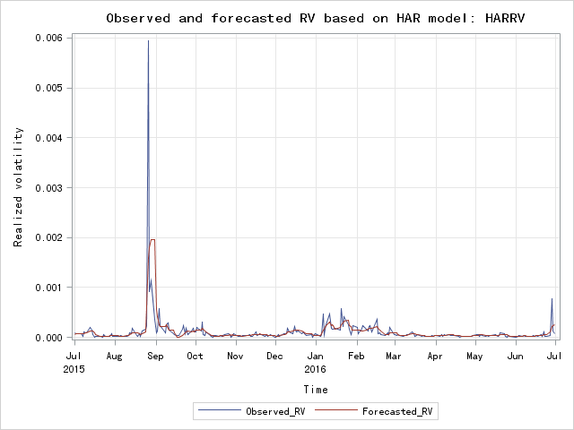
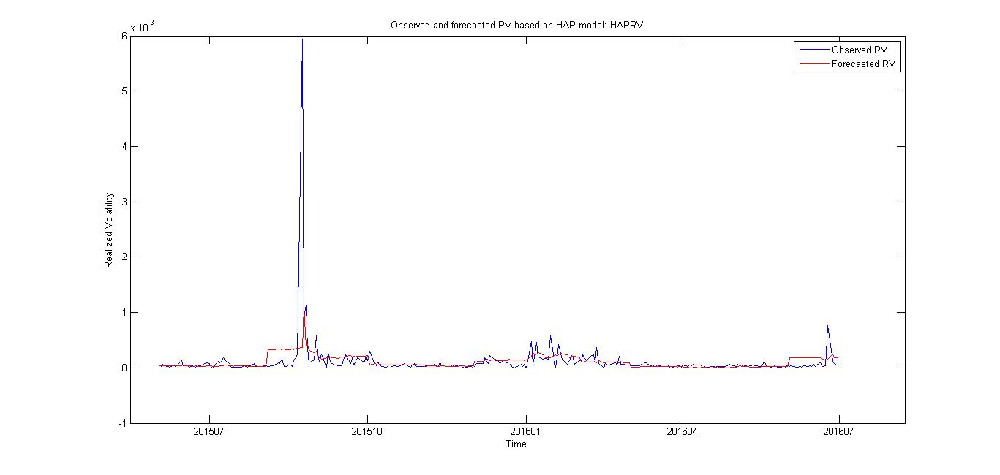
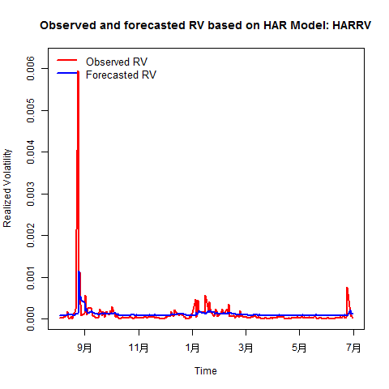

# SFM06HAR_model
[](http://quantlet.de/index.php?p=info)

## [](http://quantlet.de/) **SFM06HAR_model** [](http://quantlet.de/d3/ia)

```yaml
Name of QuantLet : SFM06HAR_model

Published in : Statistics of Financial Markets 

Description : 'Realized volatility analysis using harModel of Dow Jones Industrial Index'

Keywords : Volatility, graphical representation, time-series, log returns, variance

Author : Dexuan Tang, Ziyuan Fang, Ke Huang, Liang Tang

Submitted : Tue, July 19 2016 by Dexuan Tang

```





# SAS code
```sas
libname proj1 'Z:\SFM';

/*import the data*/
proc import out=proj1.RV
datafile="Z:\SFM\DJIA_for_SAS.csv"
dbms=csv replace;
run;

/*select DJIA data from Jun,1,2015 to Jun,30,2016*/
data proj1.DJIA_rv;
set proj1.RV;
where DateID>=20150601 and DateID<=20160630;
RV_daily= DJI2_rv;
if RV_daily="" then delete;
keep DateID RV_daily;
run;

/*create two labels for time and transform DateID into a date variable*/
data proj1.DJIA_rv;
set proj1.DJIA_rv;
t1=_n_;
t2=_n_;
DateID=input(put(DateID,z8.),yymmdd10.);
format DateID yymmdd10.;
keep t1 t2 DateID RV_daily;
run;

/*create leading 1 day daily realized volatility time sequence*/
data proj1.lead_RV_daily;
set proj1.DJIA_rv;
t2=t1+1;
lead_RV_daily=RV_daily;
keep t2 lead_RV_daily;
run;

/*calculate  weekly and monthly realized volatility for each DateID*/
%macro cal_RV_weekly_and_monthly(a,b);
%do x= &a %to &b;
  data proj1.temp1;
  set proj1.DJIA_RV;
  where &x-4<=t2<=&x;
  run;

  proc means data=proj1.temp1 noprint mean;
  var RV_daily;
  output out=proj1.temp2;
  run;

  data proj1.temp3;
  set proj1.temp2;
  if _STAT_='MEAN' then RV_weekly=RV_daily;
  if RV_weekly=.  then delete;
  t2=&x;
  keep t2 RV_weekly;
  run;

  %if &x=&a %then %do;
    data proj1.RV_weekly;
	set proj1.temp3;
	run;
  %end;

  proc append base=proj1.RV_weekly data=proj1.temp3;

  data proj1.temp4;
  set proj1.DJIA_RV;
  where &x-21<=t2<=&x;
  run;

  proc means data=proj1.temp4 noprint mean;
  var RV_daily;
  output out=proj1.temp5;
  run;

  data proj1.temp6;
  set proj1.temp5;
  if _STAT_='MEAN' then RV_monthly=RV_daily;
  if RV_monthly=.  then delete;
  t2=&x;
  keep t2 RV_monthly;
  run;

  %if &x=&a %then %do;
    data proj1.RV_monthly;
	set proj1.temp6;
	run;
  %end;

  proc append base=proj1.RV_monthly data=proj1.temp6;
%end;

proc sort nodupkey data=proj1.RV_weekly;
by t2;
run;

proc sort nodupkey data=proj1.RV_monthly;
by t2;
run;

quit;
%mend;

%cal_RV_weekly_and_monthly(22,275);

/*prepare the data for runing the HAR-RV model regression*/
data proj1.reg_rv;
merge proj1.DJIA_rv proj1.lead_RV_daily proj1.RV_weekly proj1.RV_monthly;
by t2;
if RV_monthly=""  then delete;
keep DateID t2 lead_RV_daily RV_daily RV_weekly RV_monthly;
run;

/*run the HAR-RV model regression*/
proc reg data=proj1.reg_rv noprint outest=proj1.betas;
model lead_RV_daily = RV_daily RV_weekly RV_monthly;
run;
quit;

/*get the coefficients of the HAR-RV model regression*/
data proj1.betas;
set proj1.betas;
call symput ("beta_daily",RV_daily);
call symput ("beta_weekly",RV_weekly);
call symput ("beta_monthly",RV_monthly);
call symput ("Int",Intercept);
run;

/*simulate the realized volatility by the HAR-RV model regression*/
data proj1.temp;
set proj1.reg_rv;
lead_RV_daily_est=&beta_daily.*RV_daily+&beta_weekly.*RV_weekly+&beta_monthly.*RV_monthly+&Int.;
keep DateID lead_RV_daily_est lead_RV_daily;
run;

/*prepare the data for ploting the observed RV and forecasted RV*/
proc expand data=proj1.temp out=proj1.plot method=none;
convert DateID = lead_DateID /transformout = (lead 1);
run;

data proj1.plot;
set proj1.plot;
Observed_RV=lead_RV_daily;
Forecasted_RV=lead_RV_daily_est;
keep lead_DateID Observed_RV Forecasted_RV;
run;

/*plot the observed RV and forecasted RV*/
proc sgplot data=proj1.plot;
title "Observed and forecasted RV based on HAR model: HARRV";
yaxis grid label ="Realized volatility";
xaxis grid label ="Time";
series x=lead_DateID y=Observed_RV;
series x=lead_DateID y=Forecasted_RV;
run;
```





# Matlab code
```matlab
clear all

% Import the data
DJAI = csvread('DJIA_for_Matlab.csv');

% Read the sequences
Date = DJAI(:,1);
YYYY = fix(Date/10000);
MM = fix((Date-10000*YYYY)/100);
DD = mod(Date,100);
Date_NO = datenum(YYYY,MM,DD);
YYYYMM = 1000*YYYY + MM;
RV_Day = DJAI(:,2);
Returns = DJAI(:,3);

% Get RV(d)_{t+1} and RV(d)_{t}
Returns_t = Returns(2:end);
Returns_lagt = Returns(1:end-1);

% Get RV(w)_{t} and RV(m)_{t}
L = length(Date);
RV_week = zeros(L,1);
RV_month = zeros(L,1);

count = [];
for ii= 1:(L-1)
    if Date_NO(ii+1)-Date_NO(ii)==1
        count = [count ii];
    else
        count = [count ii];
        RV_week_temp = (Returns_t(count)-Returns_lagt(count))' *(Returns_t(count)-Returns_lagt(count));
        RV_week(count) = RV_week_temp;
        count = [];
    end
end
RV_week_temp = Returns(count)' *Returns(count);
RV_week(count) = RV_week_temp;

count = [];
for ii= 1:(L-1)
    if YYYYMM(ii+1)==YYYYMM(ii)
        count = [count ii];
    else
        count = [count ii];
        RV_month_temp = Returns(count)' *Returns(count);
        RV_month(count) = RV_month_temp;
        count = [];
    end
end
RV_month_temp = (Returns_t(count)-Returns_lagt(count))' *(Returns_t(count)-Returns_lagt(count));
RV_month(count) = RV_month_temp;

% HAR regression
Y = RV_Day(2:end);
X = [ones(L-1,1) RV_Day(1:end-1) RV_week(1:end-1) RV_month(1:end-1)];
b = (X'*X)\(X'*Y);
Forecasted_Y = X*b;

% Plot the sequences
Date_string = datestr(Date_NO(2:end));
plot(Date_NO(2:end),Y,'b-',Date_NO(2:end),Forecasted_Y,'r-')
datetick('x','yyyymm','keeplimits')
title('Observed and forecasted RV based on HAR model: HARRV')
xlabel('Time')
ylabel('Realized Volatility')
legend('Observed RV','Forecasted RV')
```





#R code
```r
# Clear enviorenment
graphics.off()
rm(list = ls())

# import the data realized_library of realized_library from text files
# Load packages
library(zoo)
library(xts)
library(highfrequency)

# Select Dow Jones
realized_library$V1 = as.Date(as.character(realized_library$V1),"%Y%m%d")
realized.xts = xts(realized_library[,-1],realized_library$V1)
DJI_RV = realized.xts$V2

# Remove NA's
DJI_RV = DJI_RV[!is.na(DJI_RV)]

# Select data from 20150701 to 20160630
DJI_RV = DJI_RV["2015-07-01/2016-06-30"]
head(DJI_RV)
class(DJI_RV)

# Apply har model
DJ   = harModel(data = DJI_RV, periods = c(1, 5, 22), RVest = c("rCov"), 
                type = "HARRV", h = 1, transform = NULL)
summary(DJ)
png(file = "DJ1.png")
plot(DJ,xlab="2015-07-01/2016-06-30")

dev.off()

realized_library <- read.csv("C:/Users/julytang/Desktop/realized_library.csv", header=FALSE)
View(realized_library)
```
